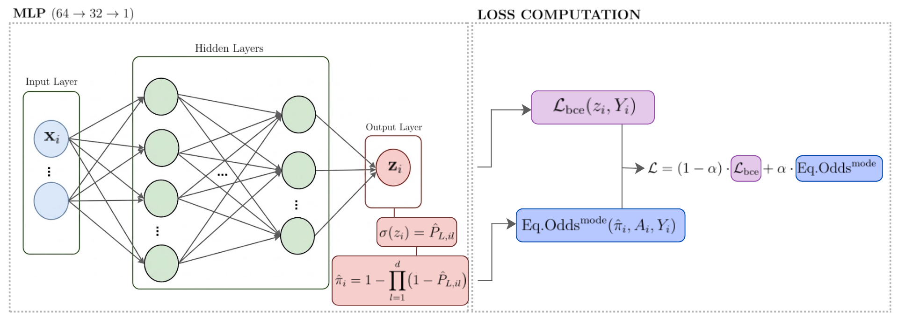

<h1 align="center">
An Equitable Framework for<br>
Dynamic Credit Risk
</h1>

<h3 align="center">
Fairness Penalization in Discrete-Time Survival Models
</h3>

This repository contains the source code developed as part of a Master's thesis in Data Science and Engineering at the Politecnico di Torino during the 2025–2026 academic year.

The core contribution is an in-processing fairness penalty designed for a discrete-time
survival landmark model (`M_DYNAMIC`), where equalized odds is enforced across the loan lifetime rather than at a single point. A static binary classifier (`M_STATIC`) serves as the baseline, letting us compare how fairness behaves when it is imposed once at origination against when it is maintained dynamically across landmarks.
<p align="center">
  
</p>

## What this project does

We study how fairness in credit risk evolves over the life of a loan, and how
it can be enforced over time. Four contributions:

1. **A longitudinal, demographically annotated dataset**, built by linking
   loan-level repayment data with mortgage records carrying the protected
   attributes, complemented by synthetic scenarios that inject bias in
   controlled forms and intensities.

2. **Two comparable models**, static (`M_STATIC`) and dynamic (`M_DYNAMIC`),
   differing only in how they treat time, so any gap in fairness or performance
   comes from the framework alone.

3. **A time-aware fairness penalty**, based on the separation criterion and
   computed at multiple landmarks, with configurable aggregation modes and
   temporal weights.

4. **A metric for fairness over time**, measuring separation as a curve over
   the loan lifetime rather than a single number.
   
## Repository structure

```
├── config.py                     # Central configuration: model, training, fairness, and data parameters
├── run_thesis.ipynb              # End-to-end pipeline
│
├── data_generation/
│   ├── simulation/                # R scripts generating synthetic survival data under 4 discrimination scenarios
│   │   ├── genvar.R                  # Generation of time-varying covariates (X3, X4, X6)
│   │   ├── timevarying_gnrt.R        # Time-varying function generation
│   │   ├── traindtv_autocorr_gnrt.R  # Autocorrelated training data generation
│   │   ├── utils.R
│   │   └── run.R                     # Entry point for the simulation pipeline
│   │
│   └── realData/                  # Real-data pipeline (Freddie Mac SFLLD + HMDA)
│       ├── match_FreddieMac_HMDA.py  # Matches loan-level records to HMDA demographic data
│       ├── build_panel.py            # Builds the longitudinal (panel) dataset
│       ├── sampling.py               # Weighted undersampling for class imbalance
│       ├── preprocessing.py          # Cleaning and preprocessing of the panel dataset
│       ├── EDA.ipynb                 # Exploratory data analysis
│       └── EDA__finalData.ipynb      # EDA on the final processed dataset
│
├── src/
│   ├── models/
│   │   └── mlp.py                 # MLP
│   ├── losses/
│   │   ├── eo_static.py           # Equalized-odds penalty for M_STATIC
│   │   └── eo_dynamic.py          # Equalized-odds penalty for M_DYNAMIC with alpha_schedule (decay/growth/flat/u_shaped/n_shaped)
│   ├── data/
│   │   ├── build_static.py        # Builds the static dataset
│   │   └── build_dynamic.py       # Builds the landmark-stacked dynamic dataset
│   ├── training/
│   │   ├── train_mlp.py           # Core training loop
│   │   └── run_train.py           # Training orchestration (CV, grid search)
│   └── evaluation/
│       ├── fairness_metrics.py    # Separation / adTPR / adFPR computation
│       ├── fairness_plots.py      # Fairness visualization utilities
│       └── fold_evaluation.py     # Per-fold performance and fairness aggregation
│
└── experiments/
    ├── run_simulation.py          # Runs M_STATIC / M_DYNAMIC on simulated scenarios (single run or grid search)
    └── run_realData.py            # Runs M_STATIC / M_DYNAMIC on the processed real dataset (single run or grid search)
```

## Getting started

The pipeline is designed to run end-to-end from `run_thesis.ipynb` (Colab-oriented), which covers:

1. **Simulation** — generate synthetic data (`data_generation/simulation/run.R`), then train/evaluate (`experiments/run_simulation.py`), optionally as a grid search over the fairness penalty coefficients (`ALPHA`, `BETA`).
2. **Real data** — match Freddie Mac SFLLD with HMDA (`match_FreddieMac_HMDA.py`), build the longitudinal panel (`build_panel.py`), apply weighted undersampling (`sampling.py`) and preprocessing (`preprocessing.py`), then train/evaluate (`experiments/run_realData.py`), optionally as a grid search over the fairness penalty coefficients (`ALPHA`, `BETA`).

Example (simulation):
```bash
cd data_generation/simulation && Rscript run.R
python experiments/run_simulation.py \
    --data_dir data_generation/simulation/<run_folder> \
    --scenario fair
```

Example (real data):
```bash
python data_generation/realData/match_FreddieMac_HMDA.py --drive_root <path> --year 2024
python data_generation/realData/build_panel.py --drive_root <path> --year 2019
python data_generation/realData/sampling.py --path <path>/output/
python data_generation/realData/preprocessing.py --path_in <path>/output/panel_sampled.csv --path_out <path>
python experiments/run_realData.py --data_path <path>/output/panel_cleaned.csv --config experiments/configs/real_data_config.yaml
```

## Configuration

All key parameters (fairness penalty weights `ALPHA`/`BETA`, EO aggregation mode, MLP architecture, training hyperparameters, landmark schedules, sensitive attribute selection, grid search ranges, W&B logging) are centralized in `config.py`.


## Experiment tracking

Training runs can be logged to [Weights & Biases](https://wandb.ai/) (`USE_WANDB` in `config.py`).
